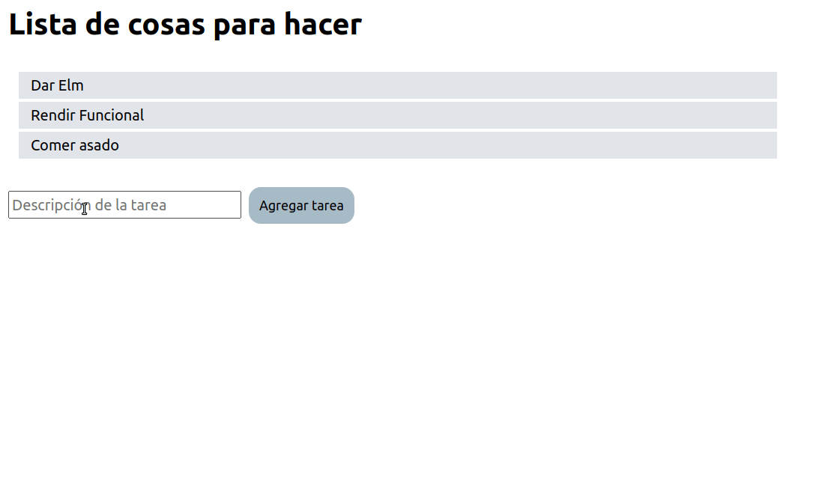

## Diapositivas

[Link a las diapositivas](https://docs.google.com/presentation/d/16L1Iin6Au1CHNSr7QXFxIn3b0kAHzMgfo4mediIHRbg/edit)

## Ejemplo en Elm: Lista de cosas para hacer

La idea es tener una interfaz de usuario utilizando el paradigma funcional, donde tenemos una lista de cosas para hacer y queremos

- poder agregar una nueva tarea
- eliminar una tarea que ya hicimos.

## Cómo ejecutar este ejemplo

- Instalar Elm siguiendo [estos pasos](https://guide.elm-lang.org/install/elm.html)
- Luego en Git Bash o la línea de comandos:

```bash
npm install
elm reactor
```

y luego abrís un navegador en `http://localhost:8000/src/Main.elm`.

## Para editarlo

Recomendamos hacerlo desde [Visual Studio Code](https://code.visualstudio.com/), con el plugin `elmtooling.elm-ls-vscode`.

## La filosofía de trabajo de Elm

Elm necesita separar 

- el modelo, o estado de la vista, que es inmutable
- la vista, que se compone de elementos gráficos (ejemplo: labels o etiquetas, cuadros de texto que permiten ingresar input, botones, etc.)
- y eventos que reaccionan ante estímulos del usuario

## Nuestro estado

Veamos el caso de uso general, por la pantalla nos damos cuenta que necesitamos:

- la lista de tareas a realizar
- una potencial nueva tarea, que inicialmente es un string vacío

La lista es inicialmente inmutable.

## Mostrar las tareas

El componente principal es la función `view` que sabe renderizar la información de una lista de tareas. Para eso...

```elm
view model =
    div []
        ...
        , div []
            (List.map         -- transformación
                taskView         -- a un componente visual que muestra las tareas
                model.tareas     -- de una lista de tareas
            )
```

...fíjense que está delegando a otro componente (la función **taskView**) el mostrar cada uno de los elementos.

La función taskView sabe cómo mostrar **una tarea**.

## Eliminar una tarea

En el componente taskView, vemos que no solo se muestra la información sino que registramos el evento `onClick` asociándolo a la función que elimina una tarea:

```elm
taskView task =
    div [ class "task-label", onClick (EliminarTarea task) ]
        [ span [] [ text task ] ]
```

Por supuesto, esto genera una nueva lista sin la tarea que queremos borrar

```elm
        EliminarTarea tarea ->
            { tareas = List.Extra.remove tarea model.tareas, nuevaTarea = "" }
```

EliminarTarea forma parte de las funciones que actualizan el estado de nuestra app, usando la notación _syntax record_ de Elm, muy parecida a la de Haskell:

```elm
type alias Model =
    { tareas : List String
    , nuevaTarea : String
    }
```

## Agregar una tarea

Para agregar una tarea, tenemos que permitir que haya un input que registre la información en el valor `nuevaTarea` de nuestro modelo, para eso tenemos que asociar el evento `onInput` para que genere un nuevo estado con la información que se registró:

```elm
        , input [ placeholder "Descripción de la tarea", value model.nuevaTarea, onInput ActualizarTarea ] []
```

Aquí vemos cómo funciona la actualización de ese estado:

```elm
        ActualizarTarea tarea ->
            { tareas = model.tareas, nuevaTarea = tarea }
```

Eso permite que el botón "Agregar tarea" tome el estado y llame a la función que inserta la nueva tarea:

```elm
        , button [ onClick (AgregarTarea model.nuevaTarea) ] [ text "Agregar tarea" ]
```

Vemos la función AgregarTarea, que obviamente construye una nueva lista (nuestro modelo es inmutable):

```elm
        AgregarTarea tarea ->
            { tareas = model.tareas ++ [ tarea ], nuevaTarea = "" }
```

## El modelo actualiza la vista

Cada vez que se genera un nuevo estado, se invoca la función view que muestra el nuevo HTML.


## Material recomendado

- https://elmprogramming.com/
- https://elm-lang.org/examples

